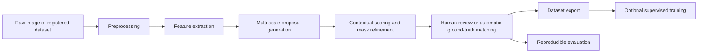

# StructVision-AI

**Human-in-the-Loop Visual Anomaly Proposal, Dataset Construction, and Reproducible Evaluation for Structural Surface Inspection**

StructVision-AI is a research-oriented computer-vision framework for generating, ranking, reviewing, and evaluating visual anomaly proposals when task-specific labelled data are limited or unavailable. It integrates classical and contextual feature analysis, multi-scale proposal generation, segmentation-ready masks, human-in-the-loop annotation, registered dataset intake, leakage-safe splitting, reproducible batch experimentation, baseline comparison, category-wise analysis, bootstrap confidence intervals, configurable ablation studies, and optional downstream YOLO integration. The current system is an anomaly-proposal and dataset-construction environment; it is not a finished defect classifier or an engineering diagnostic system.

## Abstract

Visual inspection research frequently begins before representative labelled data, reliable class definitions, or trained domain models are available. StructVision-AI investigates proposal generation in this setting: candidate regions are extracted from classical image evidence, evaluated across spatial scales, compared with their local context, refined into binary masks, and ranked for review. The framework separates anomaly evidence from mask reliability, supports manual annotation and automatic matching against registered ground truth, and records dataset provenance, split assignments, code state, configurations, and evaluation outputs. Current evidence is derived from a controlled 33-image synthetic benchmark containing anomaly-present and clean artefact conditions. Experiments compare contour, fixed-threshold, multi-scale fused, and refined contextual methods, with category-wise, paired, bootstrap, and ablation analyses. These experiments establish reproducible behaviour on the controlled benchmark only. Validation on licensed, expert-reviewed structural and marine imagery remains future work.

## Research Motivation

Visual saliency, anomaly proposal, trained defect classification, and verified engineering diagnosis are distinct tasks. A bright reflection, weld edge, plate boundary, or repeating texture may be visually salient without representing damage. An anomaly proposal indicates that a region differs from its image context; a trained classifier estimates a learned category; an engineering diagnosis additionally requires validated sensing, domain expertise, and appropriate standards.

The central research question is:

> How can visually meaningful candidate regions be proposed and ranked under limited labels while reducing annotation burden and preserving reproducible evaluation?

The framework therefore emphasises transparent candidate evidence, segmentation-ready outputs, controlled reviewer decisions, and explicit experiment scope. It avoids assigning certified defect labels to pre-training proposals.

## System Overview



The Streamlit application exposes the proposal, review, dataset, and evaluation workflows through persistent navigation. Registered experiments can execute without manual image upload, and automatic results remain separate from manually reviewed records.

## Methodology

The proposal pipeline combines grayscale intensity, Canny edges, Sobel gradients, Laplacian response, local texture variation, local binary-pattern deviation, entropy-related evidence, foreground thresholding, and Lab-colour deviation. Overlapping patches at several spatial scales produce a dense anomaly field. Candidate components are filtered for area and border artefacts, split when internal heatmap evidence is incoherent, merged when spatially and visually compatible, and subjected to overlap suppression.

Each surviving region is compared with a surrounding context ring. The comparison informs local texture, colour, entropy, gradient, and internal-to-boundary edge evidence. Mask refinement removes isolated pixels, fills only small holes, smooths boundaries, retains coherent connected content, and recomputes the bounding box from the final mask.

The ranking architecture separates three scores. For evidence terms \(e_i\), reliability terms \(r_j\), and non-negative weights:

$$
E = 100\frac{\sum_i w_i e_i}{\sum_i w_i}, \qquad
R = 100\frac{\sum_j v_j r_j}{\sum_j v_j},
$$

$$
P = 100\frac{u_E(E/100)+u_R(R/100)+u_A A+u_N N}{u_E+u_R+u_A+u_N}.
$$

Here \(E\) is contextual anomaly evidence, \(R\) is mask reliability, \(A\) is area relevance, \(N\) is novelty, and \(P\) is review priority. Reliability does not independently establish anomalous content. Border suppression, coherence checks, merging, and non-maximum suppression reduce common proposal artefacts before top-\(K\) selection.

Implementation stages, feature definitions, and ablation controls are documented in [Methodology](docs/methodology.md).

## Research Contributions

The framework provides:

- a pre-training anomaly-proposal workflow that does not require a trained task-specific detector;
- explicit separation of anomaly evidence, mask reliability, and review priority;
- contextual and multi-scale candidate ranking with segmentation-ready masks;
- human review, candidate labelling, mask correction, and annotation export;
- registered dataset intake with provenance, licensing, hashing, duplicate checks, and leakage-safe group allocation;
- reproducible experiment plans containing manifest hashes, selected images, code commits, package versions, configurations, and seeds;
- automatic ground-truth matching with Top-\(K\), precision, recall, localisation, false-proposal, and timing metrics;
- category-wise analysis of anomaly categories and clean artefact robustness;
- strict paired method comparison with deterministic bootstrap intervals; and
- a configurable ablation framework that preserves the default proposal method.

These are engineering and research capabilities of the repository, not claims of state-of-the-art performance.

## Experimental Protocol

Dataset versions are registered before final evaluation. Exact image duplicates are excluded, while near-duplicate, source, and template groups remain within one split. The controlled benchmark uses deterministic group-aware allocation with seed 42. An experiment plan freezes the dataset version, split, selected image IDs, proposal methods, matching thresholds, seed, and configuration snapshot. Execution then produces one persistent automatic row per image-method pair.

Automatic ground-truth matching uses mask IoU, ground-truth overlap, and a centroid fallback for thin anomalies. Positive-image Top-\(K\) recall is defined when at least one of the first \(K\) ranked proposals matches verified ground truth. Clean images do not enter recall denominators; their proposals are evaluated as false positives. Scientific analyses require one explicit experiment ID and version, strict image-ID pairing, and consistent dataset scope.

See [Experiments](docs/experiments.md) and [Evaluation Metrics](docs/evaluation-metrics.md) for execution, resume, export, denominator, and confidence-interval details.

## Current Experimental Evidence

**These results are preliminary and are based on a small controlled synthetic benchmark. They do not establish real-world marine or structural inspection performance.**

The registered `synthetic-controlled` v1.0 dataset contains 33 generated images with exact masks. Its leakage-safe balanced split contains 15 training, 6 validation, and 12 test images. The test set comprises three thin-crack, three pitting-cluster, three normal-texture, and three specular-highlight images: six anomaly-present and six clean/no-anomaly cases. Recorded duplicate, near-duplicate, and group leakage checks are zero.

### Baseline Comparison

The following values are read from `SYN-BALANCED-001` version 1 (12 images; 48 stored rows). Top-\(K\) columns use six eligible anomaly-present images. Times are approximate per-image means on the recorded execution environment.

| Method | Top-1 / 3 / 5 / 8 recall | Precision | Proposal recall | False proposals/image | Mean time (s) |
|---|---:|---:|---:|---:|---:|
| Contour-only baseline | 0.8333 / 0.8333 / 0.8333 / 0.8333 | 0.4167 | 0.8333 | 0.75 | 0.4101 |
| Fixed-threshold baseline | 1.0000 / 1.0000 / 1.0000 / 1.0000 | 0.3715 | 0.9667 | 3.25 | 0.0731 |
| Multi-scale fused | 1.0000 / 1.0000 / 1.0000 / 1.0000 | 0.5000 | 0.7944 | 0.75 | 0.0078 |
| Refined contextual | 1.0000 / 1.0000 / 1.0000 / 1.0000 | 0.5000 | 0.7944 | 0.75 | 0.0081 |

Strict paired analysis finds the multi-scale fused and refined contextual methods tied on detection-level outcomes for all 12 test images. Refined contextual processing improves mean and best localisation IoU on eligible anomaly images, while proposal precision, proposal recall, first-hit rank, proposal count, and false-proposal count remain unchanged. Bootstrap intervals are descriptive because only 12 paired images, including 6 recall-eligible positives, are available.

### Ablation Evidence

`ABL-SYN-BALANCED-001` version 1 contains 120 completed rows: 12 images evaluated under 10 configurations. Under the repository's documented balanced score, `ABL-RERANK-ONLY` is the strongest current configuration. Its aggregate proposal recall is 0.8500 compared with 0.7944 for `ABL-FULL`; the observed difference is concentrated in pitting-cluster recall (0.7000 versus 0.5889). Thin-crack recall remains 1.0000. Normal-texture false proposals remain zero, while specular-highlight false alarms remain unresolved at three proposals per image. This controlled result does not establish that reranking-only is generally superior.

| Configuration | Main observation |
|---|---|
| `ABL-FULL` | Reference refined configuration; recall 0.7944 and 0.75 false proposals/image. |
| `ABL-RERANK-ONLY` | Highest current balanced score; improved pitting recall with unchanged thin-crack recall. |
| `ABL-NO-TEXTURE` | Aggregate detection metrics match `ABL-FULL` on this benchmark. |
| `ABL-NO-COLOUR` | Aggregate detection metrics match `ABL-FULL` on this benchmark. |
| `ABL-NO-ENTROPY` | Aggregate detection metrics match `ABL-FULL` on this benchmark. |
| Other recorded removals | Border, stability, boundary-edge, coherence, and fused-only variants share the same aggregate detection metrics here; timing differs. |

Full tables are available in [Controlled Benchmark Results](docs/results/controlled-benchmark.md) and [Ablation Study Results](docs/results/ablation-study.md).

### Specular-Suppression Experiment

`ABL-RERANK-SPECULAR-SUPPRESS` adds an opt-in, candidate-level optical likelihood model and conservative crack/pitting safeguards to rerank-only. In `SYN-SPECULAR-SUPPRESS-001` version 2 (12 images; 48 rows), specular-highlight false proposals decreased from 3.0 to 2.0 per image. Thin-crack Top-1 recall, proposal recall, and mean IoU remained 1.0000, 1.0000, and 0.9092; pitting recall remained 0.7000; normal-texture false proposals remained zero. Version 1 is retained as a negative pilot in which the initial threshold produced no reduction. The version 2 result meets the predeclared controlled criteria but is too small and synthetic to support a general claim. See [Specular Suppression](docs/results/specular-suppression.md).

## Interface and Experimental Outputs

The repository does not currently include a complete, publication-ready interface figure set. Future documentation may add licensed or generated figures for the system overview, feature maps, proposal masks, dataset dashboard, paired comparison, ablation leaderboard, and representative success and failure cases.

<!-- Add reviewed figures from docs/images/ only after provenance and redistribution checks. -->

## Repository Structure

```text
.
├── app.py, preprocess.py, feature_extraction.py      # application and image processing
├── region_proposal.py, scoring.py                    # proposal and ranking pipeline
├── dataset_intake.py, research_dataset.py            # dataset registration and splitting
├── registered_experiment.py, experiment_tracking.py  # execution and persistence
├── research_evaluation.py, research_analysis*.py     # evaluation and scientific analysis
├── ablation_study.py, synthetic_benchmark.py         # controlled studies
├── dataset_export.py, train.py, yolo_inference.py     # export and learning integration
├── tests/                                             # regression and research-semantics tests
└── docs/                                              # methodology, protocols, and results
```

## Installation

```bash
python3 -m venv venv
source venv/bin/activate
python3 -m pip install -r requirements.txt
python3 -m streamlit run app.py
```

Run the test suite with:

```bash
python3 -m unittest discover -s tests -p 'test_*.py' -v
```

## Reproducing the Controlled Benchmark

Reproduction requires the registered dataset version, manifest hash, selected image IDs, split seed, experiment ID/version, code commit, matching thresholds, configuration snapshots, and environment metadata. An experiment plan records this identity but does not run the methods. Experiment execution reads the plan and writes persistent image-method result rows; CSV and JSON exports provide analysis-ready copies without replacing the database record.

The current controlled protocol uses `synthetic-controlled` v1.0, balanced split seed 42, and `SYN-BALANCED-001` version 1. Generated data and runtime databases are intentionally ignored by Git. Detailed steps are in [Experiments](docs/experiments.md).

## Using External or Professor-Provided Data

**Do not commit professor-provided, private, restricted, or unlicensed images to the public repository.**

Register such data through Research Dataset Intake, preserve source and licence metadata, and leave redistribution disabled unless permission is explicit. Raw files, annotations, reports, and registries belong in ignored runtime directories. Final quantitative evaluation should use verified or reviewer-estimated ground truth with clearly recorded provenance. See [Dataset Management](docs/dataset-management.md).

## Limitations

**Methodological limitations.** Classical and contextual proposals identify image irregularities; they do not provide certified diagnosis. Context rings may cross structural boundaries, and matching thresholds affect measured performance. Specular highlights remain a major false-positive mode, while pitting recall remains incomplete.

**Benchmark limitations.** The controlled benchmark is small and synthetic. Only four categories occur in the balanced test split, and descriptive confidence intervals cannot support broad significance claims.

**Data limitations.** No real marine-field validation has been completed. Expert-reviewed, licensed structural datasets are not yet represented in the public repository.

**Deployment limitations.** No trained downstream model has been validated on real data. Processing time is hardware-dependent, and the current system is not calibrated for physical scale, temporal progression, or safety-critical decisions.

## Research Roadmap

### Immediate

- retain `ABL-RERANK-ONLY` as an experimental candidate;
- expand the controlled evaluation of `ABL-RERANK-SPECULAR-SUPPRESS` across seeds, reflection geometries, and bright anomaly structures;
- verify preservation of pitting recall and thin-crack localisation; and
- repeat paired controlled evaluation.

### Benchmark Expansion

- generate a substantially larger controlled benchmark;
- add corrosion-like, weld, coating, blur, illumination, reflection, and mixed-anomaly conditions; and
- evaluate multiple seeds and perturbation levels.

### Real-World Validation

- ingest professor-provided or licensed public datasets;
- establish expert-reviewed ground truth;
- perform cross-domain and category-wise evaluation; and
- study synthetic-to-real generalisation.

### Learning-Based Extension

- evaluate SAM/SAM2-assisted mask refinement;
- train YOLO detection or segmentation models after sufficient review; and
- compare proposal-assisted annotation with conventional annotation effort.

### Inspection-System Extension

- support video and frame sequences, temporal consistency, physical scale calibration, progression tracking, and uncertainty-aware active learning.

All roadmap items are planned and are not current validated capabilities.

## Citation

The following citation is provisional and should be updated after an archival release or publication:

```bibtex
@software{structvision_ai_2026,
  author = {Mrithunjoy Basumatary},
  title = {StructVision-AI: Human-in-the-Loop Visual Anomaly Proposal, Dataset Construction, and Reproducible Evaluation for Structural Surface Inspection},
  year = {2026},
  url = {https://github.com/MrithunjoyB/marine-structural-defect-inspection}
}
```

## Licence

No open-source licence has yet been declared for this repository. The absence of a licence does not grant unrestricted permission to use, modify, or redistribute the code or data. A suitable licence should be added separately after ownership and data obligations are reviewed.

## Acknowledgements

StructVision-AI was developed in the context of interests in Ocean Engineering and Naval Architecture. Faculty guidance is acknowledged generically; this repository does not imply institutional sponsorship, endorsement, or validation.
