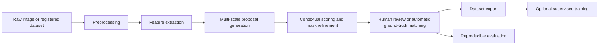

# StructVision-AI

**A modular, evidence-driven visual anomaly proposal and inspection research
platform for marine and structural imagery.**

StructVision-AI is an independent research and technical-validation platform for
generating, ranking, reviewing, and evaluating visual anomaly proposals when
task-specific labelled data are limited or unavailable. The current system is
an anomaly-proposal and dataset-construction environment; it is not a finished
defect classifier, engineering diagnostic system, or deployment-ready product.
Real-domain validation remains pending representative, licensed, expert-reviewed
data.

## Live Inspection Console

The stable frozen classical baseline is `structvision-classical-baseline-v1-frozen`. It runs locally in the base environment, requires no downloaded model, paid API, or API key, and remains the operational demonstration method because it preserves the strongest current sensitivity evidence. PatchCore is an optional protected development baseline. The proposal-guided hybrid is an optional **rejected development candidate**; its lower nuisance burden and higher precision/localisation did not satisfy the predeclared overall and image-level sensitivity-preservation rules.

After base installation, the CLI is available. Install the optional local demo dependency for Streamlit:

```bash
structvision-analyse --input inspection.png --method classical
structvision-live-demo \
  --input inspection.png \
  --output-dir build/live-demo-runs/demo-run
python -m pip install '.[demo]'
python -m streamlit run apps/structvision_demo.py
```

The presentation-oriented console command creates an explicit
`INPUT/PROCESSING/OUTPUT` record with measured stages, exposed anomaly evidence,
overlay, CSV, JSON, masks, summary, console transcript, and a run hash manifest.
It executes the frozen detector once and never installs packages or downloads
weights. The general CLI and Streamlit client retain their existing behaviour.
Current evidence is synthetic and development-only; real-data validation remains
future work.

Technical review: [Technical Handoff Guide](docs/technical-handoff.html),
[Live Console Block Diagram](docs/live-console-block-diagram.html),
[Algorithm Specification](docs/algorithm-specification.md),
[Pseudocode](docs/algorithm-pseudocode.md), [Code Guide](docs/code-structure-guide.md),
[Technical Handoff](docs/technical-handoff.md),
[Live Demonstration Runbook](docs/live-demo-runbook.md),
[Portable Storage and Immutable Legacy Paths](docs/storage-portability.md), and the
[Research Evidence Summary](docs/research-evidence-summary.md).

Build a small verified drive handoff outside the repository:

```bash
python scripts/build_technical_handoff.py \
  --output "/path/to/StructVision-AI-Technical-Handoff"
python scripts/build_technical_handoff.py \
  --verify "/path/to/StructVision-AI-Technical-Handoff"
```

The source ZIP is made with `git archive HEAD`; the working directory, virtual
environment, caches, databases, learned artifacts, private data, and historical
stores are not copied.

## Abstract

Visual inspection research frequently begins before representative labelled data, reliable class definitions, or trained domain models are available. StructVision-AI investigates proposal generation in this setting: candidate regions are extracted from classical image evidence, evaluated across spatial scales, compared with their local context, refined into binary masks, and ranked for review. The framework separates anomaly evidence from mask reliability and supports manual annotation and automatic matching against registered ground truth. Historical synthetic experiments recorded useful engineering evidence, but their plans, matcher, ordering, and result rows do not meet the prospective v2 scientific contract. No historical result is publication-valid or confirmatory. Validation on licensed, expert-reviewed structural and marine imagery remains future work.

## Research Motivation

Visual saliency, anomaly proposal, trained defect classification, and verified engineering diagnosis are distinct tasks. A bright reflection, weld edge, plate boundary, or repeating texture may be visually salient without representing damage. An anomaly proposal indicates that a region differs from its image context; a trained classifier estimates a learned category; an engineering diagnosis additionally requires validated sensing, domain expertise, and appropriate standards.

The central research question is:

> How can visually meaningful candidate regions be proposed and ranked under limited labels while reducing annotation burden and preserving reproducible evaluation?

The framework therefore emphasises transparent candidate evidence, segmentation-ready outputs, controlled reviewer decisions, and explicit experiment scope. It avoids assigning certified defect labels to pre-training proposals.

## System Overview



The Streamlit application exposes the proposal, review, dataset, and evaluation workflows through persistent navigation. Registered experiments can execute without manual image upload, and automatic results remain separate from manually reviewed records.

The same frozen classical proposal implementation is also available through the local `structvision` Python package. Its core API is independent of Streamlit, databases, report writers, global output directories, session state, and paid inference services. Direct calls return masks, half-open bounding boxes, review-priority scores, heuristic mask reliability, diagnostics, and provenance in memory. A separately installed normal-feature package path adapts the official Anomalib PatchCore implementation without changing the classical path. See [Reusable API](docs/reusable-api.md), [Normal-Feature Baseline](docs/normal-feature-baseline.md), [Algorithm Specification](docs/algorithm-specification.md), and [Architecture](docs/architecture.md).

## Methodology

The proposal pipeline combines grayscale intensity, Canny edges, Sobel gradients, Laplacian response, local texture variation, local binary-pattern deviation, entropy-related evidence, foreground thresholding, and Lab-colour deviation. Overlapping patches at several spatial scales produce a dense anomaly field. Candidate components are filtered for area and border artefacts, split when internal heatmap evidence is incoherent, merged when spatially and visually compatible, and subjected to overlap suppression.

Each surviving region is compared with a surrounding context ring. The comparison informs local texture, colour, entropy, gradient, and internal-to-boundary edge evidence. Mask refinement removes isolated pixels, fills only small holes, smooths boundaries, retains coherent connected content, and recomputes the bounding box from the final mask.

The ranking architecture separates three scores. For evidence terms \(e_i\), reliability terms \(r_j\), and non-negative weights:

$$
E = 100\frac{\sum_i w_i e_i}{\sum_i w_i}, \qquad
R = 100\frac{\sum_j v_j r_j}{\sum_j v_j},
$$

$$
P = 100\frac{u_E(E/100)+u_R(R/100)+u_A A+u_N N}{u_E+u_R+u_A+u_N}.
$$

Here \(E\) is contextual anomaly evidence, \(R\) is mask reliability, \(A\) is area relevance, \(N\) is novelty, and \(P\) is review priority. Reliability does not independently establish anomalous content. Border suppression, coherence checks, merging, and non-maximum suppression reduce common proposal artefacts before top-\(K\) selection.

Implementation stages, feature definitions, and ablation controls are documented in [Methodology](docs/methodology.md).

## Research Contributions

The framework provides:

- a pre-training anomaly-proposal workflow that does not require a trained task-specific detector;
- explicit separation of anomaly evidence, mask reliability, and review priority;
- contextual and multi-scale candidate ranking with segmentation-ready masks;
- human review, candidate labelling, mask correction, and annotation export;
- registered dataset intake with provenance, licensing, hashing, duplicate checks, and leakage-safe group allocation;
- preserved historical experiment plans and rows with their original limitations;
- a prospective immutable experiment specification tying image/truth hashes, complete configuration, evaluation policy, code state, and runtime metadata together;
- deterministic one-to-one ground-truth matching with explicit denominators, null handling, ranking eligibility, localisation, nuisance, and timing semantics;
- category-wise analysis of anomaly categories and clean artefact robustness;
- strict paired method comparison with deterministic bootstrap intervals; and
- a configurable ablation framework that preserves the default proposal method.

These are engineering and research capabilities of the repository, not claims of state-of-the-art performance.

## Experimental Protocol

Historical v1 plans and automatic rows remain under `structvision-eval-v1-historical`. Their matcher combines mask IoU, truth overlap, and a centroid fallback without one-to-one assignment, and historical baselines were not all validly ranked. Those rows retain their original meaning only.

Future scientific experiments must use `structvision-eval-v2`: an immutable `ExperimentSpecificationV2`, strict one-to-one mask-IoU assignment, Top-K only for explicitly scored and deterministically ranked methods, canonical clean-image semantics, fail-closed executed-configuration verification, and a separate append-only result store.

The protected normal-feature work uses that contract only for a synthetic **development-only — non-confirmatory** matrix. It does not turn the cohort into a test set and does not revise, replace, or validate any historical row. Its [development-data protocol](docs/development-data-protocol.md) and [artifact identities](docs/results/normal-feature-development.md) are explicit.

See [Experiments](docs/experiments.md) and [Evaluation Metrics](docs/evaluation-metrics.md) for execution, resume, export, denominator, and confidence-interval details.

## Current Experimental Evidence

**All results below are historical v1 engineering evidence. They are not confirmatory, publication-valid, or estimates under the v2 contract, and they do not establish real-world marine or structural inspection performance.**

A separate PatchCore normal-feature baseline has also been executed on a protected train/validation-only cohort. It is deliberately excluded from the historical table below: the same validation cohort was used for calibration and diagnostics, so the resulting component, pixel, and image metrics are development evidence rather than held-out estimates. The baseline shows lower clean proposal burden but misses all thin-crack components at its primary operating point; it supports no winner claim. See [Normal-Feature Development Results](docs/results/normal-feature-development.md), the [Model Card](docs/model-card-normal-feature-patchcore.md), and the [Data Card](docs/data-card-normal-feature-development.md).

The registered `synthetic-controlled` v1.0 dataset contains 33 generated images with exact masks. Its historical balanced split contains 15 training, 6 validation, and 12 test images. The test set comprises three thin-crack, three pitting-cluster, three normal-texture, and three specular-highlight images: six anomaly-present and six clean/no-anomaly cases. The legacy registry reported zero within-dataset crossings under its implemented checks; this is not a general proof of near-duplicate independence.

### Baseline Comparison

The following values are read unchanged from `SYN-BALANCED-001` version 1 (12 images; 48 stored rows). Top-\(K\) columns use six historical recall-eligible images; contour and fixed-threshold outputs were not validly ranked under v2, so their Top-K values must not be used for future comparative claims. Times are approximate per-image means on the recorded execution environment.

| Method | Top-1 / 3 / 5 / 8 recall | Precision | Proposal recall | False proposals/image | Mean time (s) |
|---|---:|---:|---:|---:|---:|
| Contour-only baseline | 0.8333 / 0.8333 / 0.8333 / 0.8333 | 0.4167 | 0.8333 | 0.75 | 0.4101 |
| Fixed-threshold baseline | 1.0000 / 1.0000 / 1.0000 / 1.0000 | 0.3715 | 0.9667 | 3.25 | 0.0731 |
| Multi-scale fused | 1.0000 / 1.0000 / 1.0000 / 1.0000 | 0.5000 | 0.7944 | 0.75 | 0.0078 |
| Refined contextual | 1.0000 / 1.0000 / 1.0000 / 1.0000 | 0.5000 | 0.7944 | 0.75 | 0.0081 |

Strict paired analysis finds the multi-scale fused and refined contextual methods tied on detection-level outcomes for all 12 test images. Refined contextual processing improves mean and best localisation IoU on eligible anomaly images, while proposal precision, proposal recall, first-hit rank, proposal count, and false-proposal count remain unchanged. Bootstrap intervals are descriptive because only 12 paired images, including 6 recall-eligible positives, are available.

### Ablation Evidence

`ABL-SYN-BALANCED-001` version 1 contains 120 completed rows: 12 images evaluated under 10 configurations. The historical arbitrary balanced score placed `ABL-RERANK-ONLY`—descriptively, the **single-scale contextual classical baseline**—first. That score is deprecated as a selector and the study does not isolate a causal “reranking-only” effect. Its historical macro per-positive-image component recall is 0.8500 compared with 0.7944 for `ABL-FULL`; the observed difference is concentrated in three pitting-cluster images. Thin-crack recall remains 1.0000. Normal-texture false proposals remain zero, while specular-highlight false alarms remain unresolved at three proposals per image.

| Configuration | Main observation |
|---|---|
| `ABL-FULL` | Reference refined configuration; recall 0.7944 and 0.75 false proposals/image. |
| `ABL-RERANK-ONLY` | Historical single-scale contextual classical baseline; highest exploratory v1 balanced score, without a causal or selection claim. |
| `ABL-NO-TEXTURE` | Aggregate detection metrics match `ABL-FULL` on this benchmark. |
| `ABL-NO-COLOUR` | Aggregate detection metrics match `ABL-FULL` on this benchmark. |
| `ABL-NO-ENTROPY` | Aggregate detection metrics match `ABL-FULL` on this benchmark. |
| Other recorded removals | Border, stability, boundary-edge, coherence, and fused-only variants share the same aggregate detection metrics here; timing differs. |

Full tables are available in [Controlled Benchmark Results](docs/results/controlled-benchmark.md) and [Ablation Study Results](docs/results/ablation-study.md).

### Specular-Suppression Experiment

`ABL-RERANK-SPECULAR-SUPPRESS` is an opt-in historical experimental configuration and remains disabled by default. In `SYN-SPECULAR-SUPPRESS-001` version 2 (12 images; 48 rows), historical v1 metrics recorded a specular-highlight false-proposal decrease from 3.0 to 2.0 per image with the listed crack, pitting, and normal-texture quantities unchanged. Version 1 is retained as a negative pilot. Neither version validates suppression or supports choosing it for future work. See [Specular Suppression](docs/results/specular-suppression.md).

The method was subsequently compared on `synthetic-expanded` v1.0. A read-only audit now shows that all 80 pilot images recur byte-for-byte in the 500-image collection and 13 recur in the final test. The prior zero near-duplicate leakage statement was not established. `SYN-EXPANDED-VALIDATION-001` v1 is therefore a **historical engineering comparison — not confirmatory**. Its stored v1 values remain unchanged: specular false proposals fell from 2.9 to 1.5 per image, one weld-disturbance image was lost, and macro per-positive-image component recall fell from 0.82 to 0.80. See [Expanded Synthetic Benchmark](docs/results/expanded-synthetic-benchmark.md) and the [overlap audit](docs/audits/historical-dataset-overlap.md).

## Interface and Experimental Outputs

The repository does not currently include a complete, publication-ready interface figure set. Future documentation may add licensed or generated figures for the system overview, feature maps, proposal masks, dataset dashboard, paired comparison, ablation leaderboard, and representative success and failure cases.

<!-- Add reviewed figures from docs/images/ only after provenance and redistribution checks. -->

## Repository Structure

```text
.
├── app.py, preprocess.py, feature_extraction.py      # application and image processing
├── apps/structvision_demo.py                          # isolated technical demonstration client
├── region_proposal.py, scoring.py                    # proposal and ranking pipeline
├── dataset_intake.py, research_dataset.py            # dataset registration and splitting
├── registered_experiment.py, experiment_tracking.py  # execution and persistence
├── scientific_contract/                               # prospective v2 evaluation/provenance
├── src/structvision/                                  # reusable APIs, demo facade, protected adapter, v2 executors
│   ├── live_console.py                                # explicit offline live-console run
│   └── normal_feature/                                 # optional official PatchCore adapter/artifacts
├── scripts/                                           # live launcher and verified technical handoff builder
├── development_data/                                  # protected canonical development manifest
├── requirements/                                      # platform-specific learned-environment lock
├── research_evaluation.py, research_analysis*.py     # evaluation and scientific analysis
├── ablation_study.py, synthetic_benchmark.py         # controlled studies
├── dataset_export.py, train.py, yolo_inference.py     # export and learning integration
├── tests/                                             # regression and research-semantics tests
└── docs/                                              # methodology, protocols, and results
```

## Installation

```bash
python3 -m venv venv
source venv/bin/activate
python3 -m pip install -r requirements.txt
python3 -m streamlit run app.py
```

For the reusable local package only:

```bash
python3 -m pip install .
structvision-analyse --input inspection.png --method classical
```

For the separate reproducible normal-feature development environment, use Python 3.12 on macOS arm64 and the complete PEP 751 lock. The package deliberately does not expose a conventional extra: the complete group/lock controls every transitive version, and the Python 3.12 package marker agrees with Anomalib's headless OpenCV instead of mixing it with desktop OpenCV:

```bash
python3.12 -m venv .venv-normal-feature
source .venv-normal-feature/bin/activate
python -m pip install -r requirements/pylock.normal-feature-macos-arm64.toml
python -m pip install --no-deps .
python cache_normal_feature_weight.py --cache-directory outputs/normal-feature-cache/huggingface/hub
```

No API key or commercial inference service is needed. Weight provenance, exact versions, integrity checks, and offline execution are documented in [Normal-Feature Baseline](docs/normal-feature-baseline.md).

```python
from structvision import DetectorConfig, StructuralAnomalyDetector

detector = StructuralAnomalyDetector(DetectorConfig())
result = detector.analyse("inspection.png", image_id="frame-001")
```

NumPy arrays with three or four channels require an explicit colour-space declaration. RGBA/BGRA arrays additionally require explicit alpha handling. `analyse` performs no caller-visible writes unless a sink is explicitly injected.

Run the test suite with:

```bash
python3 -m unittest discover -s tests -p 'test_*.py' -v
```

## Reproducing the Controlled Benchmark

Historical reproduction is limited: v1 plans record part of this identity but do not fully prove the executed configuration or make every row reconstructible. Future reproduction requires the complete immutable v2 specification, content hashes, executed-configuration match, and append-only result identity described in [Scientific Contract V2](docs/scientific-contract-v2.md).

The current controlled protocol uses `synthetic-controlled` v1.0, balanced split seed 42, and `SYN-BALANCED-001` version 1. Generated data and runtime databases are intentionally ignored by Git. Detailed steps are in [Experiments](docs/experiments.md).

The normal-feature reference run is distinct and uses only the committed protected manifest. Run `normal_feature_development.py` inside the locked learned environment after explicitly caching and verifying the official weight. The script fits only `normal_fit`, calibrates only on `calibration_validation`, writes only to an explicit ignored output directory, and fails closed on identity drift.

The separate proposal-guided hybrid work package is complete. It uses [protocol `structvision-hybrid-development-v1`](docs/development-data-protocol.md), a new implementation identity, a hybrid-specific normal memory, fusion-fit-only selection, and exactly one non-confirmatory development holdout attempt. The candidate substantially reduced clean proposal burden but failed the fixed overall and image-level sensitivity preservation criteria, so it is retained as a **rejected development candidate** and was not retuned. See [Hybrid Method](docs/proposal-guided-hybrid.md), [Development Results](docs/results/proposal-guided-hybrid-development.md), [Model Card](docs/model-card-proposal-guided-hybrid.md), and [Data Card](docs/data-card-hybrid-development.md).

## Using External or Private Collaboration Data

**Do not commit externally provided, private, restricted, or unlicensed images to the public repository.**

Connect future private data through a separately authorised adapter, preserve source and licence metadata, and leave redistribution disabled unless permission is explicit. Private paths and metadata must remain outside Git. Raw files, annotations, reports, and registries belong in ignored runtime directories. Final quantitative evaluation requires a predeclared prospective protocol and verified or reviewer-estimated ground truth with clearly recorded provenance. See [Private Dataset Adapter](docs/private-dataset-adapter.md) and [Dataset Management](docs/dataset-management.md).

## Limitations

**Methodological limitations.** Classical and contextual proposals identify image irregularities; they do not provide certified diagnosis. Context rings may cross structural boundaries, and matching thresholds affect measured performance. Specular highlights remain a major false-positive mode, while pitting recall remains incomplete.

**Benchmark limitations.** Both controlled benchmarks are synthetic. The expanded study overlaps its pilot 80/80 and its test 13/100, so it is not a protected confirmatory evaluation. The implemented historical perceptual-hash screen cannot establish zero near-duplicate leakage. Descriptive confidence intervals do not establish real-world validity.

**Data limitations.** No real marine-field validation has been completed. Expert-reviewed, licensed structural datasets are not yet represented in the public repository.

**Deployment limitations.** No trained downstream model has been validated on real data. Processing time is hardware-dependent, and the current system is not calibrated for physical scale, temporal progression, or safety-critical decisions.

## Research Roadmap

### Immediate

- retain `ABL-RERANK-ONLY` only as a historical method ID and use “single-scale contextual classical baseline” for descriptive display;
- investigate the recorded weld-disturbance suppression failure using development data only;
- verify preservation of pitting recall and thin-crack localisation; and
- repeat paired controlled evaluation.

### Benchmark Expansion

- evaluate additional generator seeds and independently implemented synthetic sources;
- add corrosion-like, coating, mixed-anomaly, and acquisition-specific conditions; and
- quantify synthetic-generator bias before further algorithm selection.

### Real-World Validation

- ingest externally provided or licensed public datasets;
- establish expert-reviewed ground truth;
- perform cross-domain and category-wise evaluation; and
- study synthetic-to-real generalisation.

### Learning-Based Extension

- treat the protected PatchCore implementation only as a baseline and preserve its failure cases;
- retain the rejected proposal-guided hybrid result without post-holdout retuning and use a new protocol/identity for any future design;
- evaluate SAM/SAM2-assisted mask refinement;
- train YOLO detection or segmentation models after sufficient review; and
- compare proposal-assisted annotation with conventional annotation effort.

### Inspection-System Extension

- support video and frame sequences, temporal consistency, physical scale calibration, progression tracking, and uncertainty-aware active learning.

All roadmap items are planned and are not current validated capabilities.

## Citation

The following citation is provisional and should be updated after an archival release or publication:

```bibtex
@software{structvision_ai_2026,
  author = {Mrithunjoy Basumatary},
  title = {StructVision-AI: Human-in-the-Loop Visual Anomaly Proposal, Dataset Construction, and Reproducible Evaluation for Structural Surface Inspection},
  year = {2026},
  url = {https://github.com/MrithunjoyB/marine-structural-defect-inspection}
}
```

## Licence

No open-source licence has yet been declared for this repository. The absence of a licence does not grant unrestricted permission to use, modify, or redistribute the code or data. A suitable licence should be added separately after ownership and data obligations are reviewed.

## Acknowledgements

StructVision-AI was developed in the context of interests in Ocean Engineering and Naval Architecture. Faculty guidance is acknowledged generically; this repository does not imply institutional sponsorship, endorsement, or validation.
