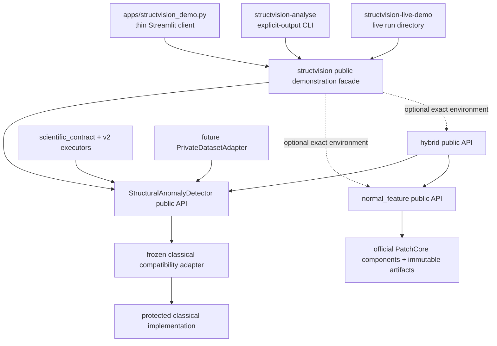

# Reviewer Source-Code Guide

## Dependency map



The algorithms never import the client. The client imports only public names from `structvision`. No Streamlit import exists under `src/structvision`.

## Important modules

| Module | Responsibility and public interfaces | Principal types | Dependencies | Status / writes / learned requirements | Protecting tests |
|---|---|---|---|---|---|
| `src/structvision/api.py` | Direct and ordered-batch orchestration: `StructuralAnomalyDetector.analyse`, `.analyse_batch` | `AnalysisResult`, `AnalysisSample`, `BatchAnalysisResult` | inputs, frozen config, classical adapter, optional injected sink | Accepted reusable component; no default write; base environment | `test_structvision_api.py`, `test_structvision_parity.py`, `test_structvision_architecture.py` |
| `src/structvision/configuration.py` | Exact frozen executable configuration, canonical JSON, hashes | `DetectorConfig`, nested configs | standard library | Frozen identity; no write; base environment | `test_structvision_configuration.py` |
| `src/structvision/classical.py` | Compatibility boundary around protected implementation | immutable `Proposal`, `AnalysisResult` | protected legacy modules, OpenCV, temporary directory | Frozen adapter; unavoidable protected writes confined to deleted temp directory; base environment | `test_structvision_parity.py`, `test_structvision_executor.py` |
| `src/structvision/executor.py` | Prospective v2 execution through the same public detector | `ExperimentSample`, `V2ExecutionReport` | API, scientific contract | No write unless caller injects sink; base environment | `test_structvision_executor.py` |
| `src/structvision/types.py` | Immutable result records and array serialization | `Proposal`, `AnalysisResult`, batch records | NumPy, provenance | No write; base environment | `test_structvision_types.py` |
| `src/structvision/inputs.py` | Path/array decoding, colour and alpha handling, hashing | `NormalisedInput` | OpenCV, NumPy | Reads caller-selected input only; no write | `test_structvision_api.py` |
| `src/structvision/sinks.py` | Explicit persistence capability boundaries | `ArtifactSink`, `ResultSink`, null/memory/SQLite sinks | scientific store only when selected | SQLite writes only after explicit sink construction/injection | `test_structvision_executor.py` |
| `scientific_contract/` | Immutable experiment specifications, fixed matching/metrics, provenance, append-only store | `ExperimentSpecificationV2`, `ResultRowV2`, matching and metric types | standard library, NumPy/OpenCV where required | Accepted evaluation contract; store writes only through explicit API | `test_scientific_contract_*.py` |
| `src/structvision/normal_feature/` | Normal-only PatchCore configuration, preprocessing, official runtime, immutable model/calibration, proposal extraction | `NormalFeatureConfig`, `NormalFeatureAnomalyDetector`, model/calibration/result types | optional exact Python 3.12 learned environment | Protected development baseline; no default write; exact learned dependencies/artifacts required | `test_normal_feature_*.py`, `test_patchcore_official_runtime.py` |
| `src/structvision/hybrid/` | Protected protocol, candidate evidence, constrained fusion selection, artifact replay, detector, one-shot holdout | `ProposalGuidedHybridDetector`, `HybridAnalysisResult`, fusion types | public classical and normal-feature APIs | Rejected development candidate; no default write; exact learned environment/artifacts required | `test_hybrid_*.py` |
| `src/structvision/demonstration.py` | Safe in-memory decoding, method readiness, one-image orchestration, result adaptation, faithful rendering, in-memory exports | `DecodedDemonstrationImage`, `DemonstrationAnalysis`, `MethodStatus` | public detector paths, Pillow/OpenCV/NumPy | Presentation only; no detector/evaluation mathematics; no writes or network | `test_technical_demonstration.py`, `test_product_architecture.py` |
| `src/structvision/cli.py` | `structvision-analyse`; terminal summary and explicitly requested output paths | exit-code contract | demonstration facade | No-write default; no database/API key/network | `test_live_cli.py` |
| `src/structvision/live_console.py` | `structvision-live-demo`; one stable frozen execution and explicit INPUT/PROCESSING/OUTPUT presentation record | deterministic exit codes; run manifest | only public `structvision` facade plus standard presentation/file encoders | No detector mathematics, network, installation, model download, API key, database, or experiment call | `test_live_console.py` |
| `apps/structvision_demo.py` | Focused technical demonstration workflow and click-initiated downloads | Streamlit session-only result | only public `structvision` imports | Thin client; upload bytes held in memory; no implicit persistence | `test_product_architecture.py`; Streamlit smoke |
| `scripts/build_technical_handoff.py` | Build/verify the small clean drive package and committed-source ZIP | checksum manifest; version/exclusion audit | `git archive HEAD`, live console | Refuses a dirty worktree; never recursively copies runtime content | `test_technical_handoff_builder.py` |
| future private adapter | Private typed records and secure image/truth opening | interface specified only | external private storage + public detector | Future direction; not implemented; never Git-tracked | future contract tests after authorised pilot |

## Protected classical call path

```text
StructuralAnomalyDetector.analyse
  └─ normalise_input
  └─ run_frozen_classical
       ├─ protected apply_preprocessing
       ├─ protected extract_feature_maps
       ├─ protected propose_regions / scoring
       └─ immutable in-memory result conversion
```

The protected hashes are verified in `src/structvision/provenance.py`. `src/structvision/classical.py` is an adapter, not an alternative implementation.

## Technical demonstration client workflow

```text
bytes or deterministic UI fixture
  → safe decode and colour/alpha declaration
  → explicit method readiness
  → one public detector call with no sink
  → typed in-memory result
  → direct mask/half-open box visualisation
  → explicit click or output-path export
```

The live console adds a presentation-only persistence boundary after the
typed result:

```text
validated local file
  → one public frozen-classical call
  → typed in-memory result
  → INPUT / PROCESSING / OUTPUT serialization
  → RUN_MANIFEST.json + CONSOLE_LOG.txt
```

The processing folder contains only exposed anomaly evidence, measured timings,
stage descriptions, and returned masks/diagnostics. Internal images that the
frozen API does not expose are labelled unavailable, not reconstructed.

## Write audit

The new one-image path does not construct `V2SQLiteResultSink`, a dataset
registry, a legacy application configuration, or an experiment executor.
PNG/JSON/CSV/summary data are built in memory. General CLI writing occurs only
when an output argument is present. Live-console writing is confined to
the required explicit output directory; protected legacy temporaries are
redirected into and removed from that directory. Streamlit transfers a download
only from an explicit download control.

The legacy `app.py` remains separate and continues to own its existing upload/output/ablation/review/report writes. The technical demonstration client does not import it.

## Review entry points

1. Read [Algorithm Specification](algorithm-specification.md).
2. Inspect `src/structvision/api.py` and `src/structvision/types.py`.
3. Follow the frozen adapter into `src/structvision/classical.py`.
4. Inspect optional learned boundaries in `normal_feature/` and `hybrid/`.
5. Confirm the console wrapper in `src/structvision/live_console.py`.
6. Confirm the thin client in `apps/structvision_demo.py`.
7. Review `scripts/build_technical_handoff.py` and its exclusion verifier.
8. Review `scientific_contract/` separately from direct one-image analysis.
