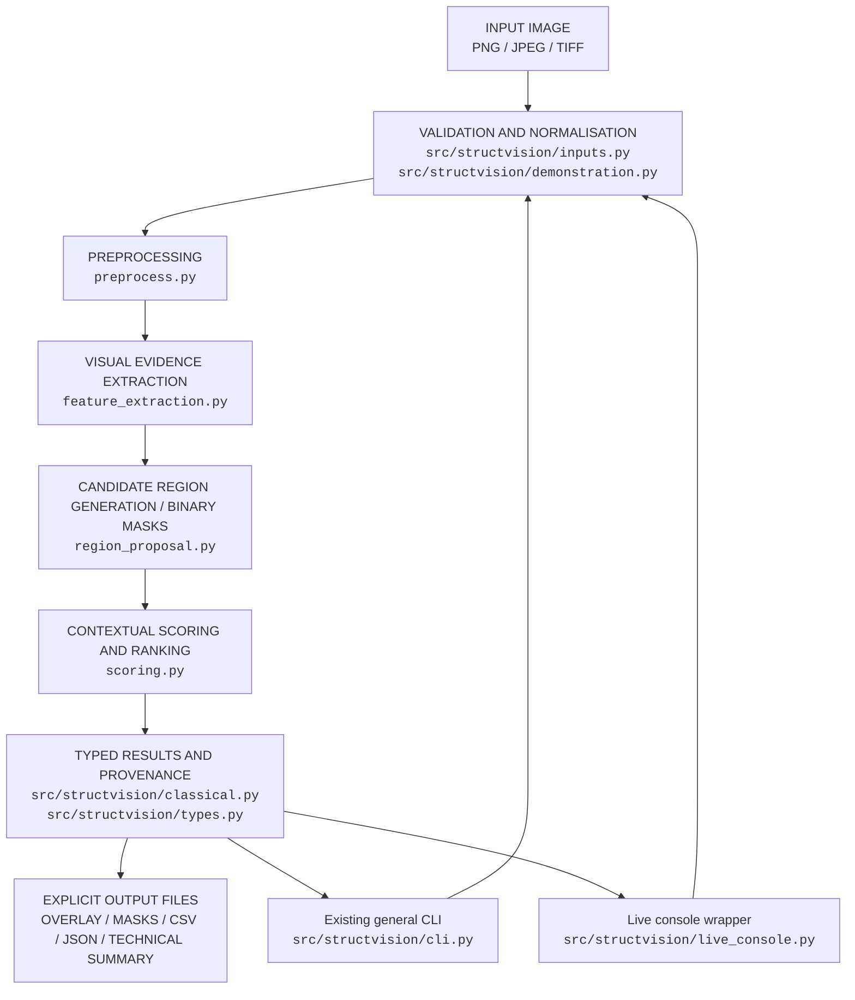
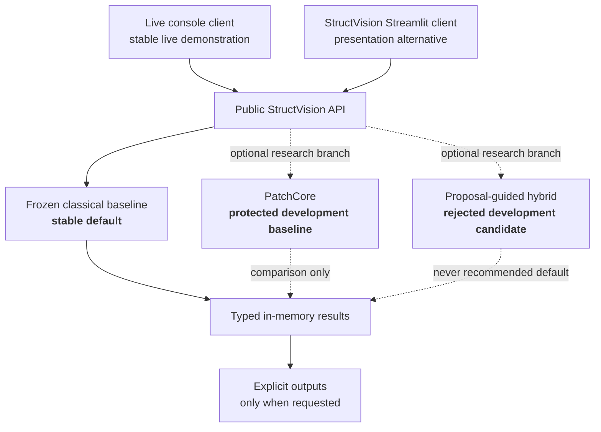

# Live Inspection Console Block Diagrams

The diagrams describe presentation and data flow only. They do not redefine
the frozen detector.

## Input–processing–output pipeline

## Client and method architecture

Status language is deliberate: PatchCore remains development-only and the
hybrid remains rejected under the predeclared protocol. Neither branch is
required for the live console demonstration.
